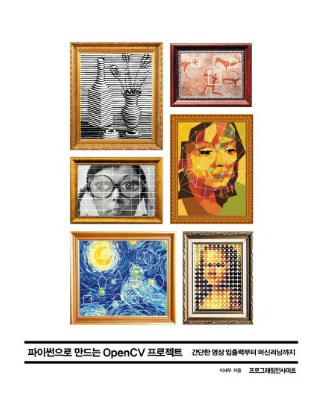

# KDT(Korea Digital Training)- OpenCV

교재 : 파이썬으로 만드는 OpenCV 프로젝트

- 이세우, 프로그래밍인사이트
  [교재 사이트](https://product.kyobobook.co.kr/detail/S000001033077)  
   [교재 소스 코드](https://github.com/dltpdn/insightbook.opencv_project_python)

#### 개발환경

| 패키지 이름 | 버전   |
| ----------- | ------ |
| Python      | 3.8.18 |
| cv2(OpenCV) | 4.9.0  |

   
   
|날짜(Date) | 제목 | 네이버 블로그 | 관련 디렉토리 |
| --------  | ---  | -----------| ------------|
| 24.03.21  |OpenCV 개요, 컴퓨터 비전 개요 |[Naver Blog](https://blog.naver.com/mathnoah/223390639608)| -- |
| 24.03.21  |UltraEdit, struct을 활용한 바이트 데이터 시각화 | [Naver Blog](https://blog.naver.com/mathnoah/223390744828)|DAY01/01_mnist_number.ipynb|
| 24.03.21  |OS 모듈 | [Naver Blog](https://blog.naver.com/mathnoah/223390805579)|DAY01/02_dir_path.ipynb |
| 24.03.22  | OpenCV 기초 | [Naver Blog](https://blog.naver.com/mathnoah/223391854965)|DAY02/01_CV.ipynb |
| 24.03.22  | 파이썬으로 배우는 CV프로젝트 : 기본 입출력| [Naver Blog](https://blog.naver.com/mathnoah/223391858244)|DAY02/01_CV.ipynb |
| 24.03.22  | 얼굴인식, Haar Cascade| [Naver Blog](https://blog.naver.com/mathnoah/223391901679)|DAY02/03_Haar_Video.ipynb, 02_Haar.ipynb |
| 24.03.22  |CNN구현, CIFAR_10 | [Naver Blog](https://blog.naver.com/mathnoah/223392040433)|DAY02/04_CIFAR_CNN.ipynb |
| 24.03.23   |CNN(Convolution Nueral Network)  |[Naver Blog](https://blog.naver.com/mathnoah/223393011260) |--|
| 24.03.24   | Torchvision |[Naver Blog](https://blog.naver.com/mathnoah/223393384047) |--|
| 24.03.24   | 파이썬으로 배우는 CV프로젝트 : Numpy |[Naver Blog](https://blog.naver.com/mathnoah/223393450182) |--|
| 24.03.25   | 파이썬으로 배우는 CV프로젝트 : 이미지 프로세싱 기초 |[Naver Blog](https://blog.naver.com/mathnoah/223394737785) |--|
| 24.03.28   | 파이썬으로 배우는 CV프로젝트 : 기하학적 변환 |[Naver Blog](https://blog.naver.com/mathnoah/223398087372) |--|
| 24.03.29   |파이썬으로 배우는 CV프로젝트 : 영상 필터  |[Naver Blog](https://blog.naver.com/mathnoah/223399040683) |--|
| 24.03.30   | 파이썬으로 배우는 CV프로젝트 : 영상 분할, 스캔, 동전 구분, 도형 판별 |[Naver Blog](https://blog.naver.com/mathnoah/223400425048) |--|

  

    목차
  

